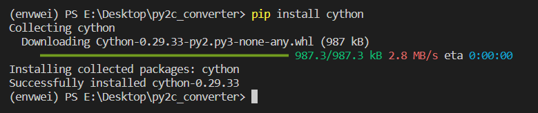
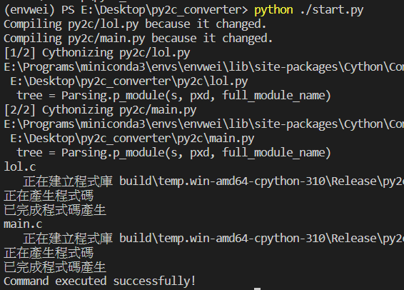
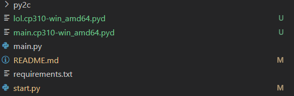

# Python to C by Cython


### Before You Start...

- Install Cython

```python
pip install cython
```



- Make sure if you have a C compiler installed on your computer

  - https://visualstudio.microsoft.com/zh-hant/visual-cpp-build-tools/

- Make sure you have setup.py inside the folder

______________________________________________________________________

## From now, here is two options to do this...

### First is using start.py

- Just put all your python files you want to convert to C into py2c folder
- Run Setup.py

```shell
python start.py
```



- Same result with the second option
- For this method, you will only see two pyd files in current folder like this
  
- Everything is done, just import your function! by

```
import main
main.main()
```

______________________________________________________________________

### Second Option is Doing it Manually

- Replace 'main.py' below with your python file name

```python
from distutils.core import setup
from Cython.Build import cythonize

setup(
    ext_modules = cythonize("main.py")
)
# you can replace main.py to your file name, or even like a list below
# ext_modules = cythonize(["main.py", "main2.py"])
```

- Below is an example function in main.py

```python
def main():
    for i in range(1,10):
        print(i)
        if i == 5:
            break
```

- Run command shown below

```shell
python setup.py build_ext --inplace
```

- After you finished those process, You will see serveral files generated

```
folder
├── main.c
├── main.cp310-win_amd64.pyd # you need to keep this file for import in python
├── main.py
├── setup.py
├── build # You can just delete this folder.
│   ├── lib.win-amd64-cpython-310
│   ├── temp.win-amd64-cpython-310
├──...
```
